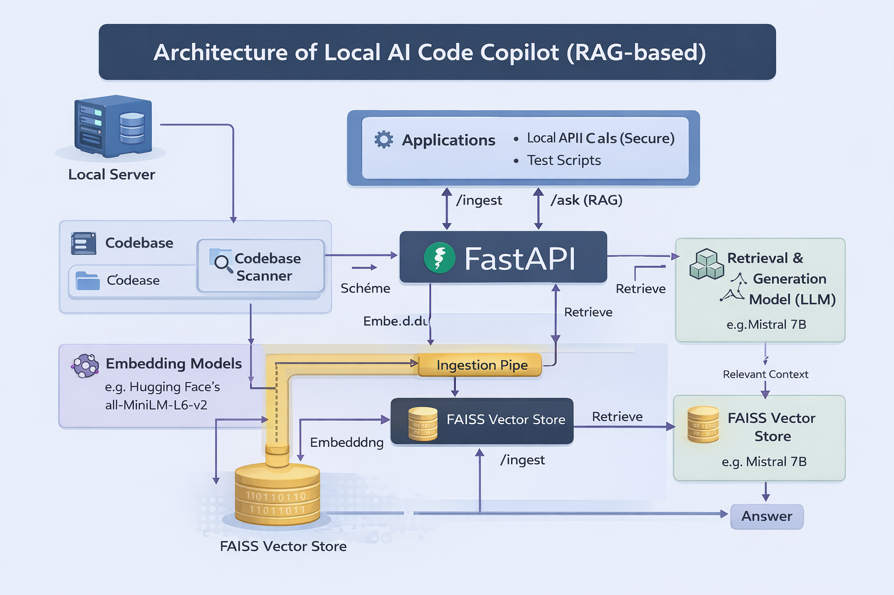
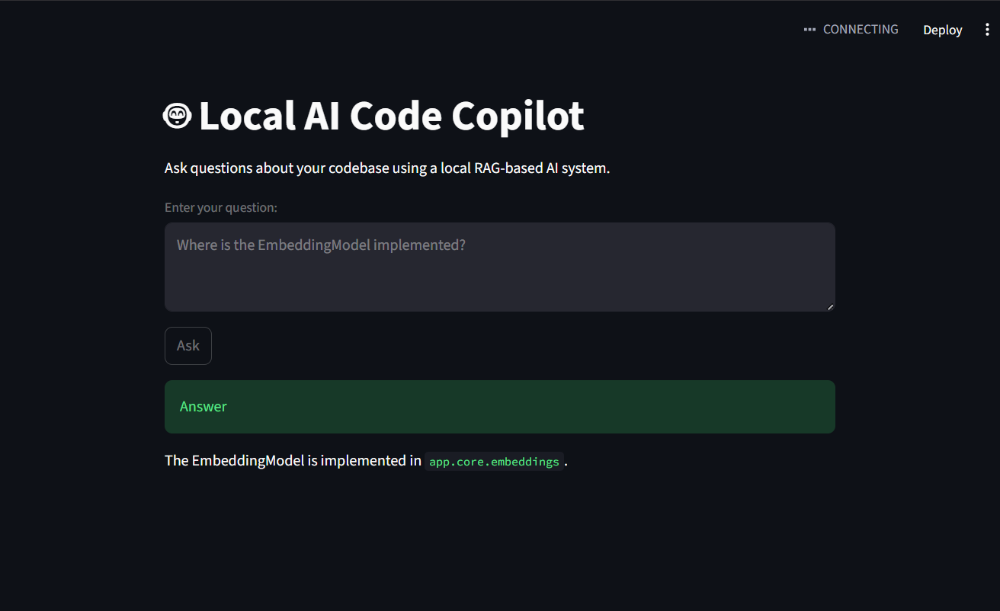

# Local AI Code Copilot (RAG-Based)

## Overview

Local AI Code Copilot is a locally hosted AI system that understands a software codebase and answers natural language questions about it.

The project is designed to run entirely on a local machine, ensuring privacy and full control over data, indexing, and inference. It uses Retrieval-Augmented Generation (RAG) to combine semantic code search with a local large language model.

This system prioritizes correctness, transparency, and engineering discipline over cloud dependency or black-box behavior.

---

## Problem Statement

Understanding large or unfamiliar codebases is time-consuming and error-prone. Traditional keyword-based search lacks semantic understanding, while cloud-based AI tools introduce privacy and data ownership concerns.

This project addresses the problem by enabling **semantic code understanding through a fully local AI pipeline**.

---

## Solution Approach

The system follows a Retrieval-Augmented Generation (RAG) approach:

* Source code is scanned and split into small, meaningful chunks.
* Each chunk is converted into vector embeddings using a transformer-based embedding model.
* Embeddings are stored in a FAISS vector index.
* When a question is asked:

  * The question is embedded.
  * Relevant code chunks are retrieved from FAISS.
  * The retrieved context is passed to a local LLM.
* The LLM generates an answer strictly based on the retrieved context.

Strict grounding is enforced to reduce hallucinations.

---

##  Architecture



**High-level flow:**

1. Codebase scanning and chunking
2. Embedding generation using SentenceTransformers
3. Vector indexing with FAISS
4. Semantic retrieval at query time
5. Local LLM inference via Ollama
6. API-based interaction using FastAPI

---

##  Demo UI

A lightweight Streamlit UI is included for interactive demos.



The UI allows users to ask questions about the codebase through a simple web interface while using the same RAG pipeline exposed by the backend API.

---

## Tech Stack

* Python 3
* SentenceTransformers
* FAISS
* Ollama (Local LLM server)
* FastAPI
* Uvicorn
* Streamlit

---

## Project Structure

```
app/
├── core/        # Embeddings, vector store, LLM interface
├── services/    # Ingestion and RAG pipeline
├── models/      # API schemas
├── main.py      # FastAPI entry point
data/
├── faiss_index/ # Persistent vector index (ignored in Git)
scripts/         # Development and test utilities
docs/            # Architecture diagram and UI output
ui.py            # Streamlit demo UI
```

---

## How It Works

* The codebase is indexed once and persisted to disk.
* On application startup, the existing FAISS index is loaded.
* Questions are answered without re-ingesting the codebase.
* Responses are generated using retrieved context only.

---

## Running the Project

### Prerequisites

* Python 3.10+
* Ollama installed
* A local LLM model available in Ollama

### Backend

```bash
pip install -r requirements.txt
python -m uvicorn app.main:app --reload
```

Open Swagger UI:

```
http://127.0.0.1:8000/docs
```

### Demo UI

```bash
streamlit run ui.py
```

---

## API Usage

### POST /ask

**Request**

```json
{
  "question": "Where is the EmbeddingModel implemented?"
}
```

**Response**

```json
{
  "answer": "The EmbeddingModel class is defined in app/core/embeddings.py..."
}
```

---

## Design Decisions

* Persistent vector index to avoid repeated ingestion
* Ingestion scope limited to application source code only
* Strict grounding to reduce hallucinations
* API-first design to support future UI extensions

---

## Limitations

* Initial indexing is computationally expensive
* Answers are paraphrased rather than verbatim source code
* UI is intentionally minimal and demo-focused

---

## Future Improvements

* Source code citations in responses
* GPU-based embedding generation
* Incremental indexing for changed files
* Enhanced UI features and filters

---

##  License

MIT License

---

